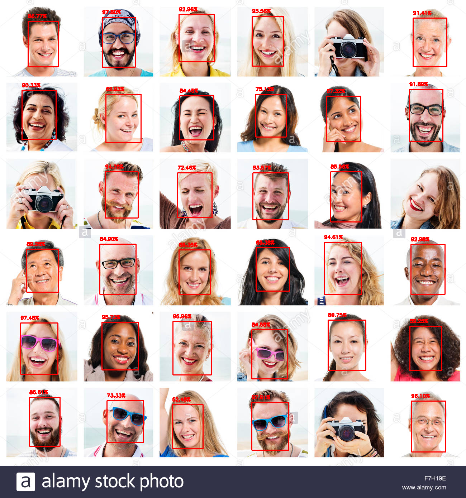
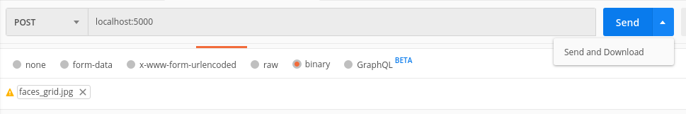

# Deteccao Facial com OpenCV e Deep Learning

Esta aplicação utiliza o módulo de detecção facial com [Deep Neural Networks do OpenCV](https://github.com/opencv/opencv/tree/master/samples/dnn/face_detector) e um modelo pré-treinado com o framework Caffe

## Utilização
Para executar o servidor Flask, utilize um dos comandos abaixo:
Linux/Unix:
`env FLASK_APP=server.py flask run`
Windows:
`set FLASK_APP=server.py python -m flask run`

Com o Postman, faça uma requisição do tipo POST enviando a imagem com a opção "binary".
Utilize a opção "Send and download" para salvar a imagem com o resultado da detecção.